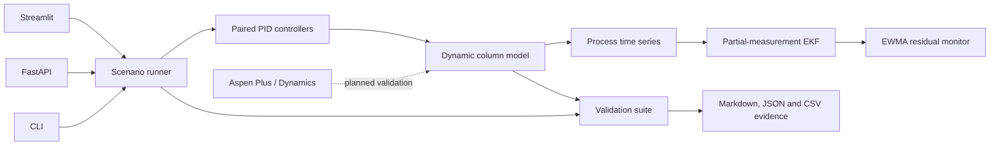

# DistillTwin

[](https://github.com/mojaffri/distilltwin/actions/workflows/ci.yml)
[](pyproject.toml)
[](https://www.python.org/)
[](LICENSE)

DistillTwin is a dynamic binary-distillation model for process-control,
state-estimation, and fault-detection experiments. The repository includes the process
model, paired composition PID loops, an extended Kalman filter, hidden-plant mismatch
benchmarks, fault injection, residual monitoring, numerical validation,
a FastAPI service, a Streamlit interface, Docker, and CI.

The open model uses constant relative volatility and constant molar overflow. It has been validated against its documented reduced-order assumptions. It has not been calibrated against Aspen Plus, Aspen Plus Dynamics, or plant data.

## Reference results

The validation suite is deterministic and runs in CI. The current reference results
were generated on August 20, 2026 and are stored under
[`docs/reference/`](docs/reference/).

| Check | Result |
|---|---:|
| Absolute light-key balance residual | `1.388e-17` |
| Maximum nominal steady-state derivative | `1.999e-08` |
| PID reduction in top-composition IAE | `26.6%` |
| PID reduction in bottom-composition IAE | `56.1%` |
| RK4 final-product difference at `dt = 0.1 min` vs. `dt = 0.05 min` | `< 9e-06` |
| EKF nominal overall state RMSE from four measured signals | `0.001913` |
| EKF overall state RMSE with hidden-plant model mismatch | `0.013775` |
| EKF convergence after unmeasured feed-composition step | Not reached in `16 min` |
| Detection delay for an injected `+0.050` analyzer bias | `0.400 min` |
| Pre-fault false-alarm fraction in that deterministic test | `0.000%` |
| Python line coverage on the local reference run | `92.28%` |

Full tables and acceptance criteria are in [`docs/VALIDATION_RESULTS.md`](docs/VALIDATION_RESULTS.md) and [`docs/VALIDATION.md`](docs/VALIDATION.md).

## Model

The column has eight equilibrium stages, a total condenser, a partial reboiler, and a saturated-liquid feed. Each state is the liquid-phase light-key mole fraction on one stage.

The vapor-liquid equilibrium relation is

```text
y = alpha*x / (1 + (alpha - 1)*x)
```

and the dynamic state equations come from stagewise light-key component balances. The default model uses `alpha = 2.4`, fixed stage holdups, constant molar overflow, and fourth-order Runge-Kutta integration.

[`src/distilltwin/model.py`](src/distilltwin/model.py) contains the balances, VLE relation, RK4 step, steady-state initializer, and open-loop simulator.

## State estimation and hidden plant

[`src/distilltwin/estimation.py`](src/distilltwin/estimation.py) implements a discrete
extended Kalman filter around the nonlinear RK4 transition. The transition
linearization propagates the analytical stage-balance Jacobian through the four RK4
stages. The reference measurement set contains top and bottom compositions plus
temperature signals on stages 2 and 5, leaving four of eight stage compositions
unmeasured.

The nominal local observability matrix has rank 8. In the stored benchmark, nominal
overall state RMSE is `0.001913`. It increases to `0.015060` for an unmeasured feed
composition step and `0.013775` when that step is combined with plant relative
volatility of `2.20` instead of `2.40` and 15% larger plant holdups. Neither case stays
within the specified `0.02` state-RMSE convergence band during the 16-minute
post-disturbance window.

[`docs/STATE_ESTIMATION.md`](docs/STATE_ESTIMATION.md) defines the measurement model,
noise assumptions, hidden-plant boundary, covariance update, observability check, and
metric definitions. Per-stage results are stored in
[`docs/reference/state_estimation_benchmark.csv`](docs/reference/state_estimation_benchmark.csv).

## Closed-loop experiments

[`src/distilltwin/scenarios.py`](src/distilltwin/scenarios.py) runs two composition-control loops around the same column model. Reflux controls the top composition and boilup controls the bottom composition. Controller outputs are constrained to a physically valid product-flow region before each integration step.

The scenario runner can apply:

- feed-composition steps;
- feed-rate steps;
- top-analyzer bias;
- reflux-valve effectiveness loss.

The controller implementation in [`src/distilltwin/control.py`](src/distilltwin/control.py) includes output limits and conditional-integration anti-windup.

For the reference feed-composition step from 0.50 to 0.62, the paired PID loops reduce top-composition IAE from `0.323078` to `0.237177` and bottom-composition IAE from `0.489333` to `0.214695`. The top loop does not settle inside the specified 0.01 error band within the 30-minute post-disturbance window; the validation report keeps that result visible.

## Fault monitoring

[`src/distilltwin/analytics.py`](src/distilltwin/analytics.py) contains the
`EWMAResidualMonitor` used for online residual alarms.

The known-fault validation injects a `+0.050` top-analyzer bias. The residual compares
that analyzer with a reference EKF updated from the bottom composition and two tray
temperature signals; it does not read the simulator's true top state. With the current
EWMA settings, the alarm appears after `0.400 min`, with no pre-fault alarms in the
deterministic reference run. That benchmark checks implementation behavior under a
defined injection; it is not an industrial false-positive estimate.

## Architecture



## Interactive app

Install the package and start the Streamlit app:

```bash
git clone https://github.com/mojaffri/distilltwin.git
cd distilltwin
python -m venv .venv
# Windows: .venv\Scripts\activate
# macOS/Linux: source .venv/bin/activate
pip install -e ".[dev]"
streamlit run webapp/app.py
```

The control-room view exposes feed disturbances, sensor bias, and valve-effectiveness faults. The validation view displays balance closure, steady-state stationarity, PID benchmarks, timestep sensitivity, and fault-detection metrics.

## Reproduce the validation bundle

```bash
distilltwin-validate --output validation-report
```

This creates:

- a Markdown report;
- structured JSON results;
- an open-loop/PID benchmark CSV;
- an RK4 timestep-sensitivity CSV;
- a per-stage EKF benchmark CSV.

CI generates the same artifact set on pull requests.

## API and CLI

Start the API:

```bash
uvicorn distilltwin.api:app --reload
```

Open `http://localhost:8000/docs` for the generated OpenAPI interface.

Example simulation request:

```bash
curl -X POST http://localhost:8000/simulate \
  -H "Content-Type: application/json" \
  -d '{
    "duration": 60,
    "disturbance_at": 20,
    "feed_composition_after": 0.62,
    "top_sensor_bias_after": 0.03
  }'
```

Run a scenario from the CLI and export its time series:

```bash
distilltwin --feed-composition 0.62 --sensor-bias 0.03
```

Run the API and dashboard in containers:

```bash
docker compose up --build
```

## Verification

```bash
ruff check .
mypy src
pytest
distilltwin-validate --output validation-report
docker build -t distilltwin .
```

The CI workflow runs Ruff, strict Mypy, tests on Python 3.11 and 3.12, an enforced 90% coverage gate, the validation export, a production Docker build, and a container-level `/health` smoke test.

## Assumptions and validation boundary

| Area | Current model | Higher-fidelity validation target |
|---|---|---|
| Thermodynamics | Constant relative volatility | Property-method and VLE comparison |
| Hydraulics | Constant molar overflow, fixed holdups | Tray hydraulics, pressure drop, equipment holdup |
| Feed | Saturated liquid | Flash-derived feed condition |
| Energy balance | Composition-based temperature proxy | Full enthalpy balances |
| Control | Composition PID with injected measurement and actuator faults | Analyzer delay, valve dynamics, temperature inference |
| Reference data | Reduced-order Python model only | Aspen Plus steady state and Aspen Plus Dynamics transients |

The Aspen work is intentionally separated from the current validation claims. [`docs/ASPEN_HANDOFF.md`](docs/ASPEN_HANDOFF.md) defines the operating points, disturbances, exports, and comparison metrics to use when licensed university access is available.

## Repository map

```text
src/distilltwin/
├── model.py        # stage balances, VLE, RK4 and steady state
├── control.py      # PID with limits and anti-windup
├── scenarios.py    # closed-loop disturbances and faults
├── estimation.py   # measurements, analytical linearization and EKF
├── estimation_validation.py # hidden-plant estimator benchmarks
├── analytics.py    # EWMA residual monitor
├── validation.py   # physics, control, numerical and fault checks
├── api.py          # FastAPI service
└── cli.py          # scenario and validation commands
webapp/app.py       # Streamlit control room and validation view
tests/              # model, controls, analytics, interfaces and validation
docs/               # architecture, validation and Aspen handoff
```

## License

MIT. See [`LICENSE`](LICENSE).
